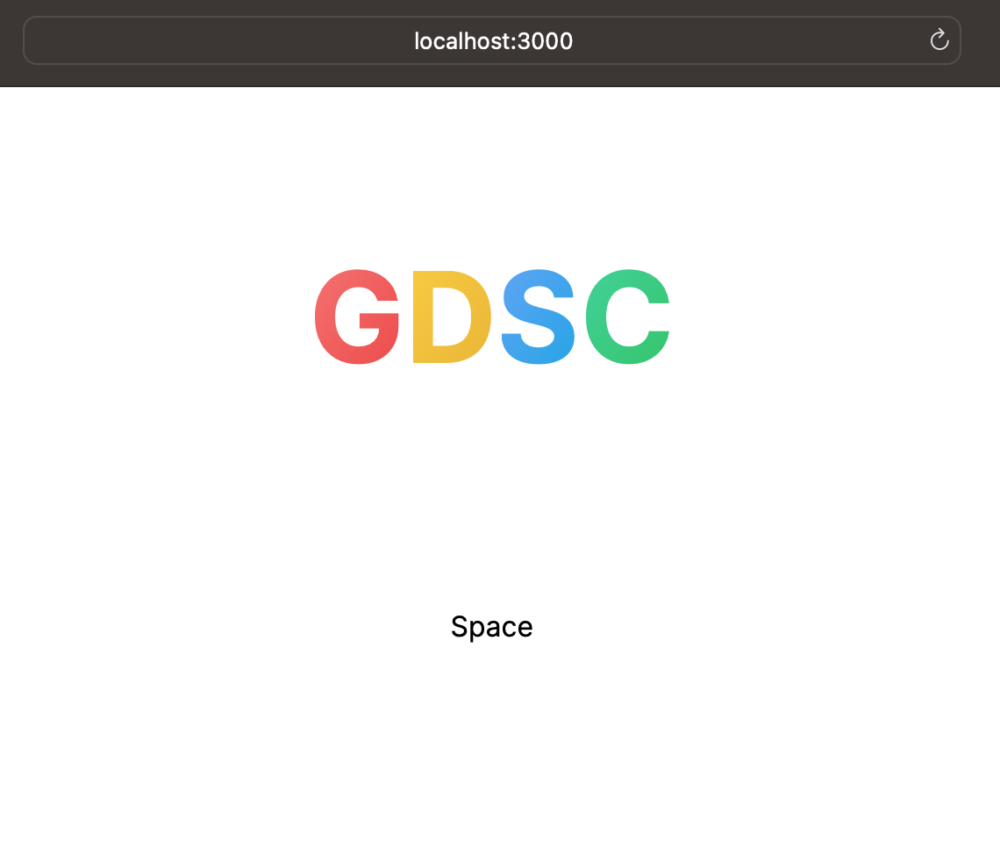

# GDSC CAU Space 🏡

## Rules 🤝

**All Rules are [here](./Rules.md).** Check it out carefully :)

## Setup ⚙️

1.  **Install IDE**
    -   vscode
    -   web storm
    -   ...
2.  **Install Plugin** at your IDE
    -   [tailwindcss](https://marketplace.visualstudio.com/items?itemName=bradlc.vscode-tailwindcss)
    -   [prettier](https://marketplace.visualstudio.com/items?itemName=esbenp.prettier-vscode)
    -   [eslint](https://marketplace.visualstudio.com/items?itemName=dbaeumer.vscode-eslint)
3.  **Install `Node.js`**

    Install [`Node.js`](https://nodejs.org/ko), recommended after `v18.x.x`

4.  **Install `pnpm`**, package manager

    `pnpm` setup documentation is [here](https://pnpm.io/installation)!

    Simply, run this command in your terminal.

    ```bash
    npm install -g pnpm
    ```

    -   `npm`: installed, when `Node.js` is installed.
    -   `pnpm`: faster version of `npm` which is package manager.

5.  **Install project dependencies**

    Run this command at your terminal

    ```bash
    pnpm i
    ```

    After installation, `node_modules` folder will be generated.

6.  **Run development server**

    ```bash
    pnpm dev
    ```

    After running this command, you can see the website at `localhost:3000`. Develope your project with this server.

    

7.  **Build project**

    Run below command at your terminal

    ```bash
    pnpm build
    ```

    After building process, you can see the website at `localhost:3000` in production mode which is optimized for performance(=lightweight version of project).

    Log message should be look like this.

    ```bash
    Route (app)                                 Size     First Load JS
    ─ ○ /                                      137 B          77.6 kB
    + First Load JS shared by all               77.5 kB
    ├ chunks/14478101-08a82aad1ad550e2.js       50.5 kB
    ├ chunks/215-693f32f7887d2092.js            25.1 kB
    ├ chunks/main-app-5d9d2d6e73ea2558.js       216 B
    └ chunks/webpack-56d4ed22b847b2bf.js        1.64 kB

    Route (pages)                               Size     First Load JS
    ─ ○ /404                                   182 B          75.4 kB
    + First Load JS shared by all               75.2 kB
    ├ chunks/framework-510ec8ffd65e1d01.js      45 kB
    ├ chunks/main-d211b781428a7a0f.js           28.3 kB
    ├ chunks/pages/_app-3e277c1f911fda65.js     195 B
    └ chunks/webpack-56d4ed22b847b2bf.js        1.64 kB

    ○  (Static)  automatically rendered as static HTML (uses no initial props)
    ```

<br />

## Core Stacks 🛠️

-   [Next.js](https://nextjs.org/) `v13.x`
-   [TypeScript](https://www.typescriptlang.org/) `v5.x`
-   [Tailwind CSS](https://tailwindcss.com/) `v3.x.x`
    ...and more!

<br />

## Run Tests 🛡️

1.  Unit test: `Jest` + `React testing library`
2.  e2e test: `Playwright`

### Test categories

1. `unit` test 🔩

Write test code using watch mode.

```bash
pnpm test
```

Run CI tests

```bash
pnpm test:ci
```

2. `e2e` test ⛰️

First, setup `Playwright` with this command.

```bash
npx playwright install
```

And then run `e2e` test.

```bash
pnpm e2e:ci
```

If you want inspect full ci test process, run this command.

```bash
pnpm e2e:inspect
```

<br />

## Project Structure Overview 📖

```

[src] - project root
 ┃
 ┣ <app> - Next.js app
 ┃
 ┣ <components> - Shared components
 ┃
 ┣ <styles> - Style sources
 ┃
 ┣ <utils> - Utility helpers
 ┃
...
```
